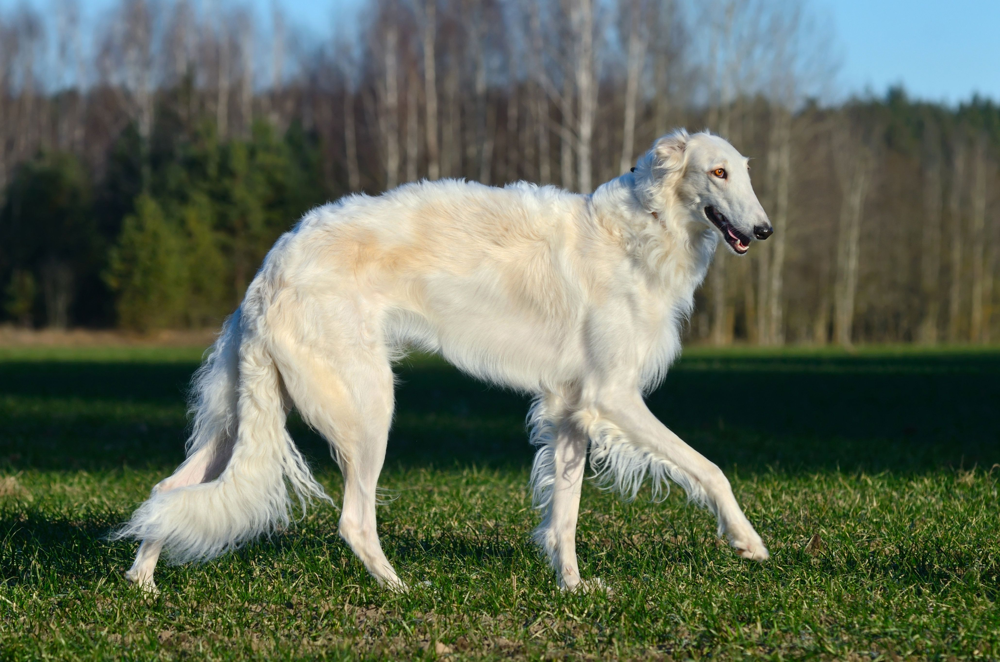
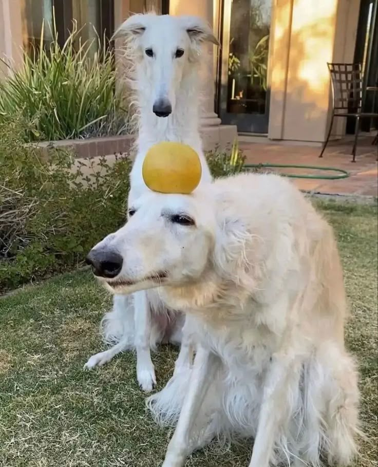
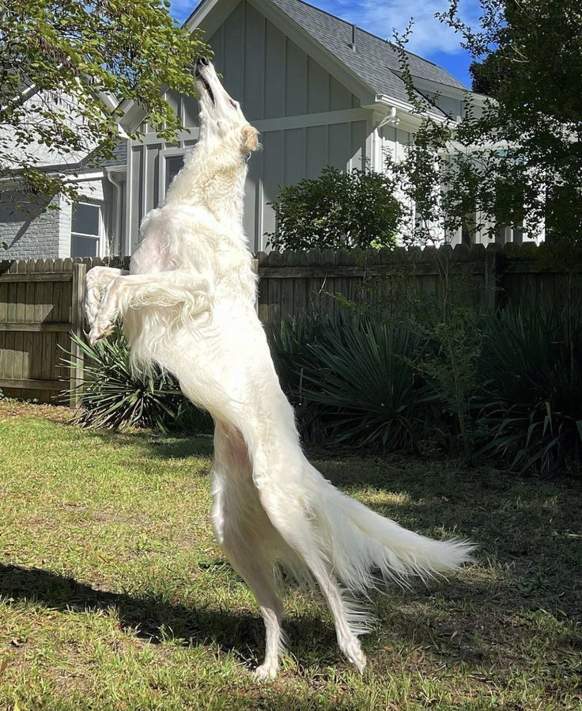
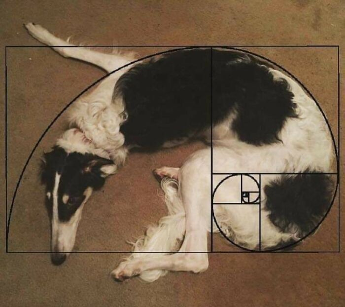

.. sphinx-lr7 documentation master file, created by
   sphinx-quickstart on Wed Jun  4 07:41:21 2025.
   You can adapt this file completely to your liking, but it should at least
   contain the root `toctree` directive.

.. toctree::
:maxdepth: 2
:caption: Contents:

Русская псовая борзая
=====================

*Русская псовая борзая (РПБ) – крупная охотничья собака, превосходно зарекомендовавшая себя в работе с пушно-меховым зверем. Также привлекается к охоте на волков.*

Основная информация
-------------------

* **Группа**: 10. Борзые  
* **Секция**: 1. Длинношёрстные борзые  
* **Страна происхождения**: Россия  
* **Рост**: 68-85 см (кобели), 65-78 см (суки)  
* **Вес**: 35-48 кг  
* **Продолжительность жизни**: 10-12 лет  

Характеристики породы
---------------------

Привязанность: 3 из 5

Дружелюбие: 4 из 5

Линька: 2 из 5

Охранные качества: 1 из 5

Здоровье: 3 из 5

Интеллект: 4 из 5

История породы
---------------------

Русская псовая борзая - порода с богатой историей, известная на Руси с XVII века. 
Изначально использовалась для охоты на волков и зайцев. 

.. note::

   Название "псовая" происходит от слова "псовина" - волнистая шелковистая шерсть, 
   а "борзая" - от слова "борзый" (быстрый).

Внешний вид
---------------------

**Основные признаки**:

* Грациозное телосложение
* Длинная волнистая шерсть
* Узкая голова с плавным переходом ото лба к морде
* Большие темные глаза
* Высокие стройные ноги

Характер
---------------------

* Спокойные и уравновешенные дома
* Энергичные на охоте
* Чувствительные к грубому обращению
* Независимые, но преданные хозяину

Содержание и уход
---------------------

**Особенности**:

1. **Пространство**: Нуждаются в просторе, не подходят для маленьких квартир
2. **Прогулки**: Требуют регулярного выгула с возможностью побегать
3. **Питание**: Склонны к завороту кишок, нужен особый режим кормления
4. **Уход за шерстью**: Еженедельное вычесывание

.. warning::

   Борзые плохо переносят анестезию из-за низкого содержания жира в организме!

Дрессировка
---------------------

* Требуют мягкого подхода
* Хорошо обучаются, но могут быть упрямы
* Важно социализировать с раннего возраста
* Охотничьи инстинкты могут помешать на прогулках

